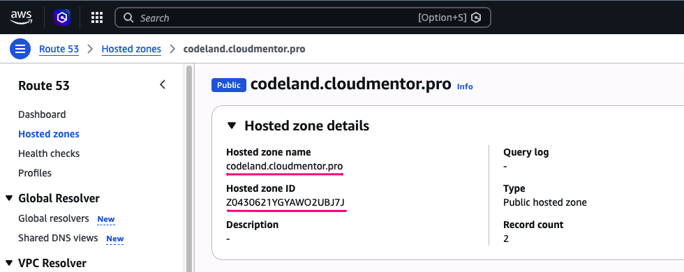

# Deployment Guide — soa AWS Infrastructure

Hướng dẫn deploy toàn bộ **hạ tầng** từ đầu, lần đầu tiên. Kết quả cuối đạt được:

- 7 stack đều `CREATE_COMPLETE`
- ALB có HTTPS, trỏ đúng domain
- RDS đã migrate schema
- ECS service đứng sẵn ở `DesiredCount=0`, chờ pipeline CI/CD (thiết lập riêng, sau này,
  **không thuộc phạm vi tài liệu này**) build/push image và scale service lên

---

## Mục lục
1. [Prerequisites](#1-prerequisites)
2. [Lấy Hosted Zone ID](#2-lấy-hosted-zone-id)
3. [Điền parameters](#3-điền-parameters)
4. [Validate templates](#4-validate-templates)
5. [Deploy Stack 1 — Networking](#5-deploy-stack-1--networking)
6. [Deploy Stack 2 — Security](#6-deploy-stack-2--security)
7. [Deploy Stack 3 — Domain](#7-deploy-stack-3--domain)
8. [Deploy Stack 4 — Database](#8-deploy-stack-4--database)
9. [Deploy Stack 5 — Config](#9-deploy-stack-5--config)
10. [Deploy Stack 6 — Compute](#10-deploy-stack-6--compute)
11. [Deploy Stack 7 — Bastion](#11-deploy-stack-7--bastion)
12. [Migrate Database qua Bastion](#12-migrate-database-qua-bastion)
13. [Verify & Test](#13-verify--test)
14. [Sau bước này — CI/CD (ngoài phạm vi)](#14-sau-bước-này--cicd-ngoài-phạm-vi)
15. [Teardown](#15-teardown)
16. [Troubleshooting](#16-troubleshooting)

---

## 1. Prerequisites

```bash
aws --version              # aws-cli/2.x.x
pip install cfn-lint
gem install cfn-nag         # optional, cần Ruby
```

### AWS CLI Profile
```bash
aws configure list --profile soa-dev
# Nếu chưa có:
aws configure --profile soa-dev
# Region: us-east-1
```

### Verify account đúng
```bash
aws sts get-caller-identity --profile soa-dev
```
⚠️ **Dừng lại nếu Account không đúng dự kiến.**

### Domain đã sẵn sàng
Bạn cần một domain đã đăng ký và **Hosted Zone tương ứng đã tồn tại trong Route53** của
account này (tự tạo Hosted Zone nếu chưa có, hoặc trỏ NS record của domain về Route53).
Không có bước này thì bỏ qua Stack 3 (Domain) và Listener 443 trong Stack 6 sẽ lỗi.

---

## 2. Lấy Hosted Zone ID và Hosted Zone name
Lấy 2 thông tin này ở account của bạn để setting vào param



---

## 3. Điền parameters

Tối thiểu cần sửa 2 file sau (còn lại đã có default hợp lý, review thêm nếu muốn đổi CIDR,
instance class, resource ECS...):

```bash
code parameters/dev-domain.json    # HostedZoneName, HostedZoneId
code parameters/dev-compute.json   # AppDomainName — phải khớp SubDomain.HostedZoneName ở trên
```

---

## 4. Validate templates

```bash
cfn-lint templates/**/*.yaml
```
✅ Không có ERROR (warning có thể bỏ qua).

---

## 5. Deploy Stack 1 — Networking

```bash
aws cloudformation create-stack \
  --stack-name dev-soa-networking \
  --template-body file://templates/networking/soa-networking.yaml \
  --parameters file://parameters/dev-networking.json \
  --profile soa-dev --region us-east-1

aws cloudformation wait stack-create-complete \
  --stack-name dev-soa-networking --profile soa-dev --region us-east-1
echo "✅ Networking ready"
```
⏱️ ~3-5 phút (NAT Gateway).

> 💡 Tip: có thể chạy song song với Stack 3 (Domain, bước 7) vì hai stack này độc lập nhau
> — chạy hai `create-stack` trên hai terminal khác nhau để tiết kiệm thời gian chờ.

---

## 6. Deploy Stack 2 — Security

```bash
aws cloudformation create-stack \
  --stack-name dev-soa-security \
  --template-body file://templates/security/soa-security.yaml \
  --parameters file://parameters/dev-security.json \
  --profile soa-dev --region us-east-1

aws cloudformation wait stack-create-complete \
  --stack-name dev-soa-security --profile soa-dev --region us-east-1
echo "✅ Security ready"
```
⏱️ ~1 phút.

---

## 7. Deploy Stack 3 — Domain

Không phụ thuộc `networking`/`security` — chỉ cần Hosted Zone ID ở bước 2. DNS validation là
bước **chậm và khó đoán nhất** trong toàn bộ pipeline nên nên deploy sớm (có thể chạy song
song với Stack 1, xem tip ở bước 5).

```bash
aws cloudformation create-stack \
  --stack-name dev-soa-domain \
  --template-body file://templates/domain/soa-domain.yaml \
  --parameters file://parameters/dev-domain.json \
  --profile soa-dev --region us-east-1

aws cloudformation wait stack-create-complete \
  --stack-name dev-soa-domain --profile soa-dev --region us-east-1
echo "✅ Domain ready"
```
⏱️ Thường ~5 phút, có thể lâu hơn nếu DNS propagation chậm.

Verify cert đã ISSUED:
```bash
aws cloudformation describe-stacks \
  --stack-name dev-soa-domain --profile soa-dev --region us-east-1 \
  --query 'Stacks[0].Outputs'
```

---

## 8. Deploy Stack 4 — Database

Stack này tạo RDS PostgreSQL — **mất nhiều thời gian nhất trong 7 stack**.

```bash
aws cloudformation create-stack \
  --stack-name dev-soa-database \
  --template-body file://templates/database/soa-database.yaml \
  --parameters file://parameters/dev-database.json \
  --profile soa-dev --region us-east-1

aws cloudformation wait stack-create-complete \
  --stack-name dev-soa-database --profile soa-dev --region us-east-1
echo "✅ Database ready"
```
⏱️ ~10-15 phút.

Verify master password đã tự tạo trong Secrets Manager:
```bash
aws cloudformation describe-stacks \
  --stack-name dev-soa-database --profile soa-dev --region us-east-1 \
  --query 'Stacks[0].Outputs'
```
→ Kỳ vọng thấy `DbSecretArn`, `DbInstanceEndpointAddress`.

---

## 9. Deploy Stack 5 — Config

Tự động lấy endpoint + secret ARN từ stack `database` — không cần copy/paste gì tay.

```bash
aws cloudformation create-stack \
  --stack-name dev-soa-config \
  --template-body file://templates/config/soa-config.yaml \
  --parameters file://parameters/dev-config.json \
  --profile soa-dev --region us-east-1

aws cloudformation wait stack-create-complete \
  --stack-name dev-soa-config --profile soa-dev --region us-east-1
echo "✅ Config ready"
```
⏱️ ~30 giây.

---

## 10. Deploy Stack 6 — Compute

Cần `domain`, `database`, `config` đã CREATE_COMPLETE trước — import cert ARN, secret ARN,
SSM parameter name từ 3 stack đó, và tạo Route53 Alias record.

```bash
aws cloudformation create-stack \
  --stack-name dev-soa-compute \
  --template-body file://templates/compute/soa-compute.yaml \
  --parameters file://parameters/dev-compute.json \
  --capabilities CAPABILITY_NAMED_IAM \
  --profile soa-dev --region us-east-1

aws cloudformation wait stack-create-complete \
  --stack-name dev-soa-compute --profile soa-dev --region us-east-1
echo "✅ Compute ready"
```
⏱️ ~2-3 phút.

> Stack tạo ECR repo rỗng và ECS Service ở `DesiredCount=0`

---

## 11. Deploy Stack 7 — Bastion

```bash
aws cloudformation create-stack \
  --stack-name dev-soa-bastion \
  --template-body file://templates/bastion/soa-bastion.yaml \
  --parameters file://parameters/dev-bastion.json \
  --capabilities CAPABILITY_NAMED_IAM \
  --profile soa-dev --region us-east-1

aws cloudformation wait stack-create-complete \
  --stack-name dev-soa-bastion --profile soa-dev --region us-east-1
echo "✅ Bastion ready"
```
⏱️ ~2-3 phút.

---

## 12. Migrate Database qua Bastion
Lấy command từ output lệnh bên dưới để login bastion:

```bash
aws cloudformation describe-stacks \
  --stack-name dev-soa-bastion --profile soa-dev --region us-east-1 \
  --query 'Stacks[0].Outputs[?OutputKey==`SsmSessionCommand`].OutputValue' --output text
# → lệnh trả về CHƯA có --profile (output không hardcode vì đó là setup cục bộ của bạn,
#   CloudFormation không biết chắc tên profile thật) — tự thêm ` --profile soa-dev` vào
#   cuối lệnh trước khi chạy
```

Trong session:
```bash
sudo su -
su - ec2-user

# Test kết nối DB (tự lấy credentials từ Secrets Manager, không cần nhập tay)
./connect-db.sh
\q

# Migration — chạy 1 lần để tạo schema, tách biệt hoàn toàn với ECS/CI-CD
cd projects
git clone {your-backend-repo-url}
cd soa-project-backend
git checkout develop

# Export DB_URL/DB_USER/DB_PASSWORD từ SSM + Secrets Manager — không cần sửa docker-compose-dev.yml bằng tay

export DB_URL=$(aws ssm get-parameter --name "/soa/dev/db-url" --query "Parameter.Value" --output text)
DB_SECRET_ARN=$(aws ssm get-parameter --name "/soa/dev/db-secret-arn" --query "Parameter.Value" --output text)
DB_SECRET=$(aws secretsmanager get-secret-value --secret-id "$DB_SECRET_ARN" --query SecretString --output text)
export DB_USER=$(echo "$DB_SECRET" | jq -r .username)
export DB_PASSWORD=$(echo "$DB_SECRET" | jq -r .password)

# Run container để migrate DB
docker-compose -f docker-compose-dev.yml down
docker-compose -f docker-compose-dev.yml up -d --build

# Kiểm tra status của container
docker-compose -f docker-compose-dev.yml ps
```

Verify:
```bash
cd
./connect-db.sh
\l
\dt
SELECT * FROM users;
\q
```

**Thoát khỏi bastion trước khi qua bước 13**
```bash
exit    # thoát su - ec2-user
exit    # thoát sudo su -
exit    # thoát session SSM, quay về máy local
```

---

## 13. Verify & Test

```bash
aws cloudformation list-stacks \
  --profile soa-dev --region us-east-1 \
  --stack-status-filter CREATE_COMPLETE UPDATE_COMPLETE \
  --query 'StackSummaries[?contains(StackName, `soa`)].{Name:StackName,Status:StackStatus}' \
  --output table
```
→ Kỳ vọng thấy đủ 7 stack `CREATE_COMPLETE`.

```bash
APP_URL=$(aws cloudformation describe-stacks \
  --stack-name dev-soa-compute --profile soa-dev --region us-east-1 \
  --query 'Stacks[0].Outputs[?OutputKey==`AppUrl`].OutputValue' --output text)

curl -I http://${APP_URL#https://}     # kỳ vọng: 301 → https (đúng ngay cả khi chưa có task)
curl -I $APP_URL                       # kỳ vọng: 503 — BÌNH THƯỜNG vì ECS DesiredCount=0,
                                        # chưa có image/task nào chạy phía sau target group
```
503 ở bước cuối **không phải lỗi hạ tầng** — nó xác nhận ALB, cert, DNS đều hoạt động đúng.
200 chỉ xuất hiện sau khi pipeline CI/CD (mục 14) đã build/push image và scale service.

---

## 14. CI/CD (ngoài phạm vi)
CICD thực hiện thông qua Github Action - hướng dẫn ở tài liệu khác

---

## 15. Teardown

⚠️ **Xóa theo thứ tự ngược lại** — bastion/compute trước, networking/domain sau cùng.

Nếu CI/CD đã từng build/push image, ECR repo sẽ còn image bên trong — CloudFormation không tự
xoá được, xoá stack `compute` sẽ fail (`DELETE_FAILED`). Empty ECR repo **trước** khi xoá stack
để tránh lỗi này ngay từ đầu (mất luôn image, CI/CD build/push lại được bất cứ lúc nào):
```bash
aws ecr delete-repository --repository-name dev-soa-ecr-api --force --profile soa-dev --region us-east-1 2>/dev/null || true
```

```bash
for layer in bastion compute config database domain security networking; do
  aws cloudformation delete-stack --stack-name dev-soa-$layer --profile soa-dev --region us-east-1
  aws cloudformation wait stack-delete-complete --stack-name dev-soa-$layer --profile soa-dev --region us-east-1
  echo "✅ $layer deleted"
done
```

> Layer `database` dùng `DeletionPolicy: Delete` — xoá stack là mất DB thật, **không** để lại
> snapshot (chủ đích, dự án demo/dev). Muốn giữ lại data trước khi xoá thì tự backup tay:
> ```bash
> aws rds create-db-snapshot \
>   --db-instance-identifier dev-soa-rds-database \
>   --db-snapshot-identifier dev-soa-rds-database-manual-backup \
>   --profile soa-dev --region us-east-1
> ```

⚠️ **CNAME validation của ACM Certificate không tự xoá theo stack `domain`.** Khi tạo
Certificate với `DomainValidationOptions` + `HostedZoneId`, CloudFormation tự tạo giúp 1 CNAME
record trong Hosted Zone để validate — nhưng record đó **không được CloudFormation track như
resource của stack**, nên xoá stack `domain` không xoá theo. Sau khi xoá hết 7 stack, dọn tay:


Deploy `domain` lại lần sau sẽ tự tạo CNAME mới (token khác) — record cũ để lại chỉ là rác,
không gây lỗi khi deploy lại, nhưng nên dọn cho sạch Hosted Zone.

---

## 16. Troubleshooting

### `compute` stack DELETE_FAILED — "repository ... cannot be deleted because it still contains images"
Quên bước empty ECR ở mục 15 trước khi xoá. Chạy lại lệnh `aws ecr delete-repository --force`
ở mục 15, rồi `delete-stack` lại — CloudFormation sẽ thấy resource đã mất và hoàn tất phần còn lại.

### Stack bị ROLLBACK_FAILED
```bash
aws cloudformation describe-stack-events \
  --stack-name dev-soa-{layer} --profile soa-dev --region us-east-1 \
  --query 'StackEvents[?ResourceStatus==`CREATE_FAILED`].{Resource:LogicalResourceId,Reason:ResourceStatusReason}' \
  --output table
```

### ACM Certificate bị stuck (không validate được)
Nguyên nhân thường gặp: `HostedZoneId` sai trong `parameters/dev-domain.json`.
```bash
aws route53 list-resource-record-sets \
  --hosted-zone-id {your-hosted-zone-id} \
  --profile soa-dev --region us-east-1 \
  --query 'ResourceRecordSets[?Type==`CNAME`]' \
  --output table
```
Nếu không thấy CNAME validation record nào → Hosted Zone ID sai → sửa lại và deploy lại stack
`domain`.

### Database stack chậm / stuck
RDS tạo mất 10-15 phút là bình thường. Nếu quá 20 phút, kiểm tra events — thường do
`DBSubnetGroup` thiếu subnet ở đủ 2 AZ, hoặc `VPCSecurityGroups` trỏ sai SG.

### `Cannot find version X.X for postgres`
AWS định kỳ deprecate các minor version cũ của RDS PostgreSQL — version default trong template
có thể không còn khả dụng theo thời gian. Lấy danh sách version đang thật sự khả dụng trong
account/region của bạn:
```bash
aws rds describe-db-engine-versions --engine postgres --profile soa-dev --region us-east-1 \
  --query "DBEngineVersions[?starts_with(EngineVersion,'18')].EngineVersion" --output table
```
Chọn 1 version trong danh sách trả về, sửa `DBEngineVersion` trong `parameters/dev-database.json`,
rồi `create-stack` lại (stack cũ đã rollback nên không cần `delete-stack` trước).

### Compute stack fail vì thiếu export `dev-soa-domain-CertificateArn`
Stack `domain` chưa CREATE_COMPLETE, hoặc `DomainStackName` trong `parameters/dev-compute.json`
gõ sai tên stack. Kiểm tra:
```bash
aws cloudformation list-exports --profile soa-dev --region us-east-1 \
  --query 'Exports[?contains(Name, `soa-domain`)]'
```

### `curl $APP_URL` trả về 503
Bình thường nếu chưa chạy CI/CD (mục 14) — ECS `DesiredCount=0`, không có task nào phía sau
target group. Chỉ cần lo nếu **đã** deploy image + scale lên ≥1 mà vẫn 503, xem mục kế tiếp.

### ECS task không healthy trong Target Group (sau khi đã có image + DesiredCount≥1)
```bash
aws elbv2 describe-target-health \
  --target-group-arn $(aws elbv2 describe-target-groups \
    --names dev-soa-tg-api --profile soa-dev --region us-east-1 \
    --query 'TargetGroups[0].TargetGroupArn' --output text) \
  --profile soa-dev --region us-east-1
```
Nguyên nhân thường gặp:
- `HealthCheckPath` (`/users/ping`) không khớp route thật của app
- Execution Role thiếu quyền đọc Secrets Manager/SSM → task CREATE nhưng crash ngay,
  xem CloudWatch Logs group `/aws/ecs/dev-soa-api`

### Export không tìm thấy khi deploy layer sau
```bash
aws cloudformation list-exports \
  --profile soa-dev --region us-east-1 \
  --query 'Exports[?contains(Name, `soa`)].{Name:Name,Value:Value}' \
  --output table
```
Nếu thiếu export → layer dependency chưa deploy xong, deploy đúng thứ tự trước.

---

## Tóm tắt thời gian deploy

| Stack | Thời gian | Bước tốn thời gian |
|---|---|---|
| networking | ~5 phút | NAT Gateway |
| security | ~1 phút | Security Groups |
| domain | ~5 phút (chạy song song networking) | ACM DNS validation |
| database | ~10-15 phút | RDS instance creation |
| config | ~30 giây | SSM Parameters |
| compute | ~2-3 phút | ALB, ECS Cluster, Route53 record (task=0, chưa chạy) |
| bastion | ~2-3 phút | EC2 boot + UserData |
| **Tổng (build hạ tầng, chưa tính CI/CD)** | **~25-30 phút** | |
